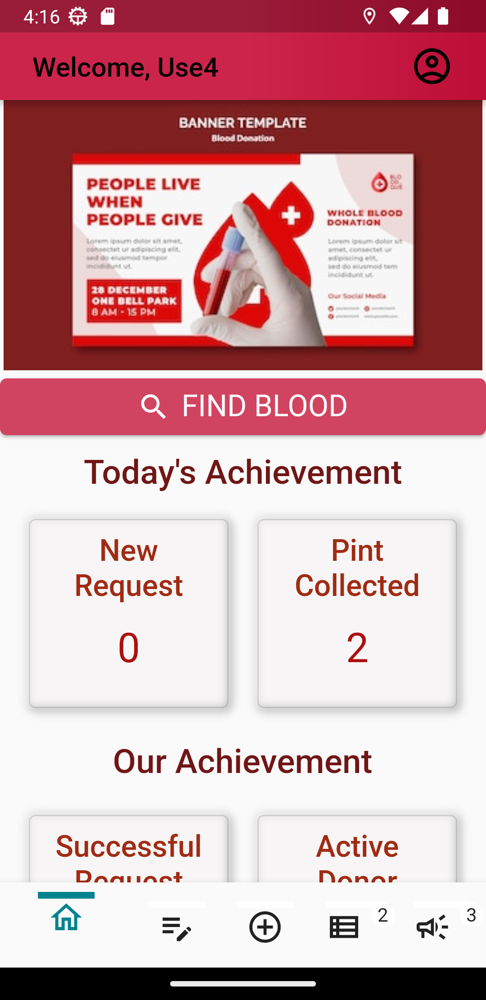
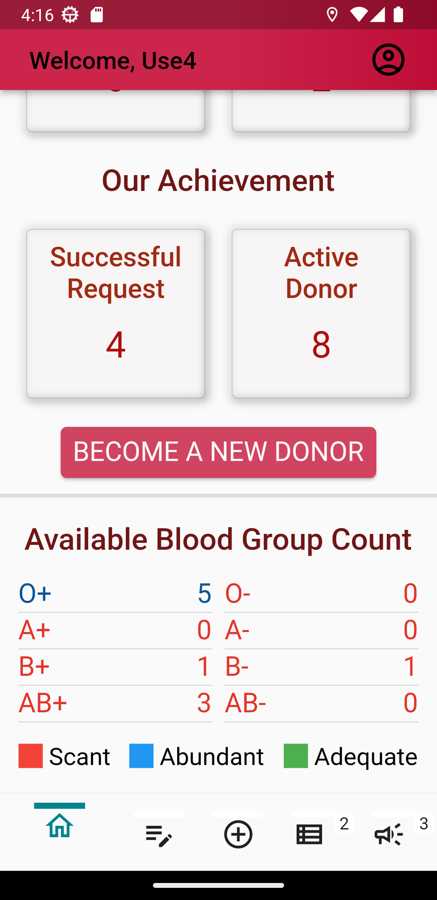
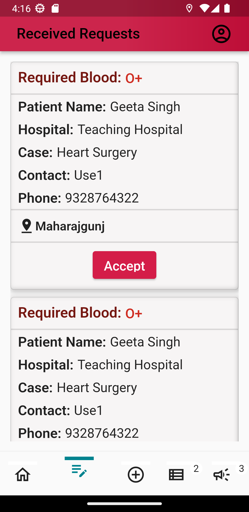
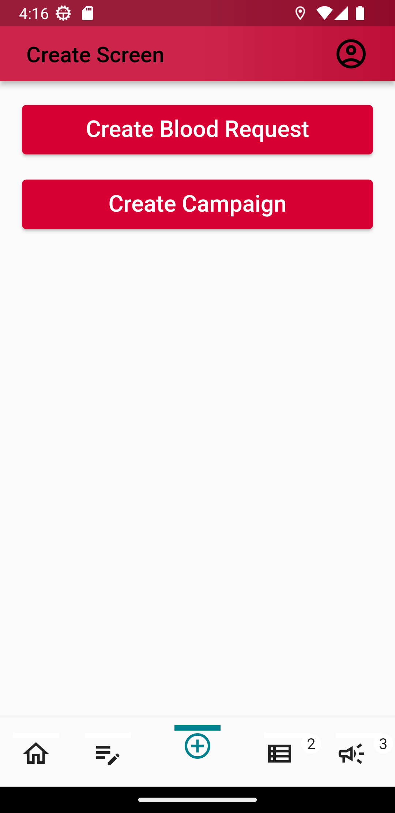
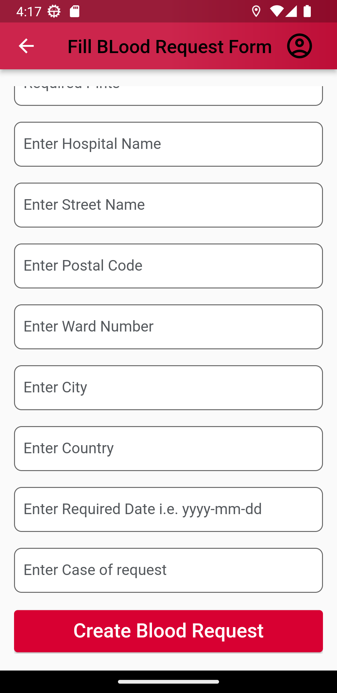
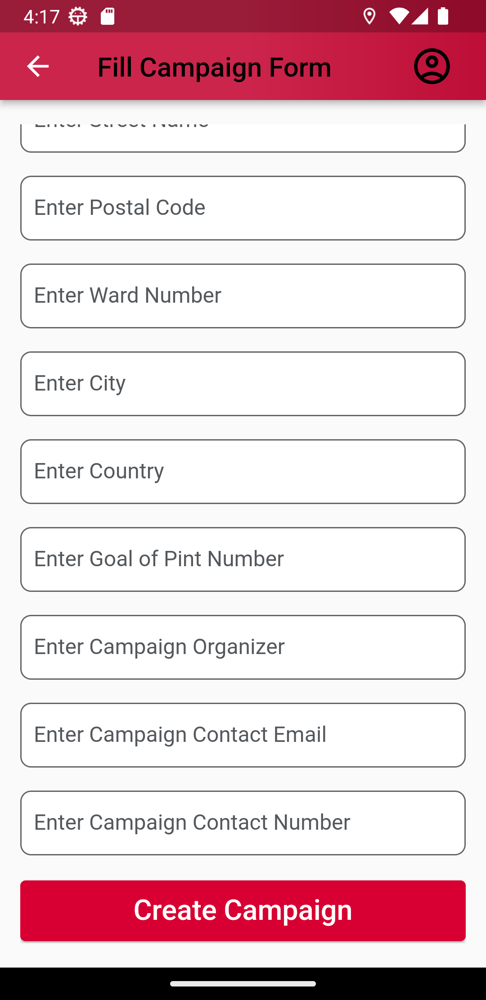
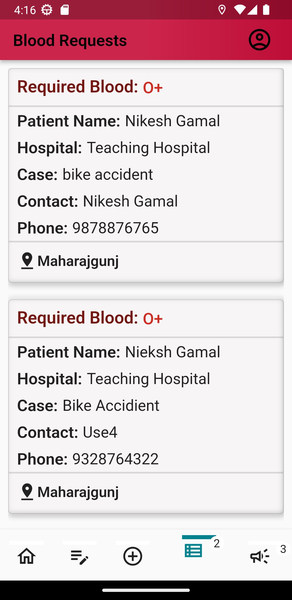
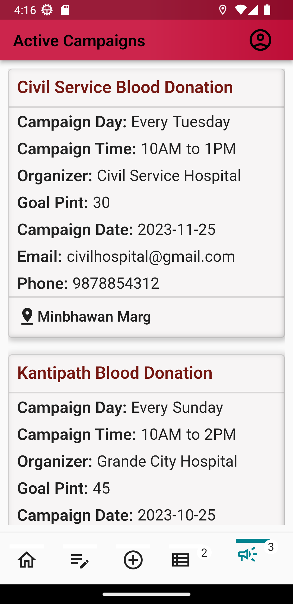
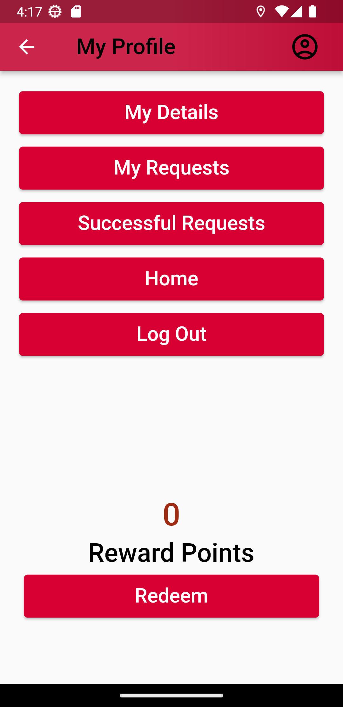

### Bloodlink

Bloodlink is a Flutter-based mobile application that addresses the critical need for efficient blood donor connections during emergencies. It leverages real-time notifications and donor verification to connect donors with recipients within a specified radius, improving the accessibility and efficiency of blood transfusions. The app also offers an advertising platform for healthcare institutions and blood donation campaigns to promote awareness.

### Key Features

Real-time notifications for blood donation requests.
Instant connections between donors and recipients.
Donor verification and reward points to cash-in for service coupon to encourage people for donation

### Screenshots of blood link app
# Homescreen:
<table>
  <tr>
    <td></td>
    <td></td>
  </tr>
</table>

# Received Requests:
<table>
  <tr>
    <td></td>
  </tr>
</table>

# Create Screen:
<table>
  <tr>
    <td></td>
  </tr>
</table>

# Blood request form Screen:
<table>
  <tr>
    <td></td>
  </tr>
</table>

# Camapgin create Screen:
<table>
  <tr>
    <td></td>
  </tr>
</table>

# Active Blood Requests Screen:
<table>
  <tr>
    <td></td>
  </tr>
</table>

# Active Campaigns Screen:
<table>
  <tr>
    <td></td>
  </tr>
</table>

# Profile Screen:
<table>
  <tr>
    <td></td>
  </tr>
</table>

<!--  -->
